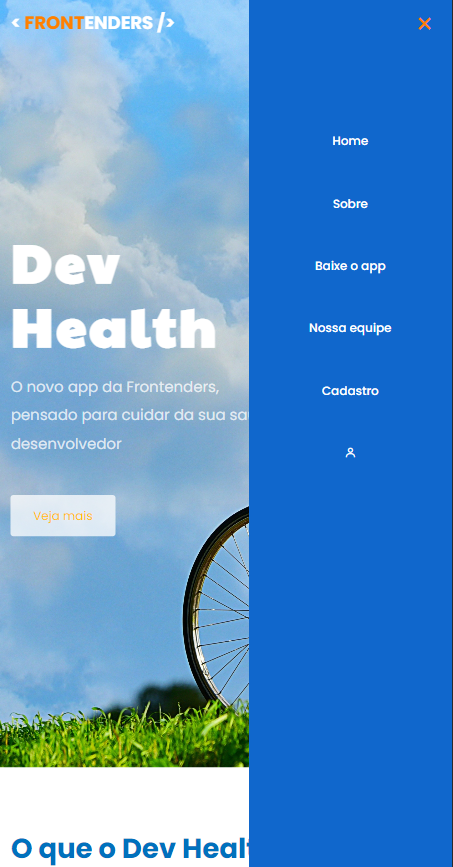

<h1  align="center"> :ocean: Dev Health  </h1>

<h2> :sparkles: Descrição da Página </h2>

Esse foi o nosso segundo projeto em grupo para o curso Programadores Cariocas, o objetivo dele era que o squad criasse uma página para a empresa de tecnologia Frontenders, que está lançando um novo produto. O produto que criamos foi o DevHealth, um aplicativo de monitoramento focado na saúde do desenvolvedor, com lembrentes, anotações, conselhos e boas práticas para a hidratação e a ginástica laboral.

Você pode checar o projeto clicando <a href="https://daysecampos.github.io/devHealth/">aqui</a>, acessando o link na descrição ou baixando.

<h2> :wink: Mais detalhes </h2>

Nossa página é composta pelo seguinte menu:

<ul>
<li>Home - Página inicial;</li>
<li>Sobre - Leva até uma área da página inicial, fala sobre o aplicativo e os seus benefícios;</li>
<li>Baixe o app - Também leva até uma área na página inicial, nela você pode ver os planos de assinatura do produto e links para baixar em diferentes lojas de aplicativos;</li>
<li>Nossa equipe - Página com contato dos integrantes da squad</li>
<li>Cadastro - Página onde o usuário pode realizar o cadastro, utilizamos a API ViaCEP para o autopreenchimento de informações de endereço do usuário;</li>
<li>Login - Um modal que contém input para e-mail e senha, além de "Recuperar a senha", todos com autenticação para checar se o usuário colocou informações corretas.</li>
</ul>

Toda a página também foi estruturada com responsividade, então é possível acessá-la em qualquer dispositivo sem perder nenhuma funcionalidade. 

  

<h2> :hammer: Tecnologias Utilizadas </h2>

    

<h2> :rocket: Contribuidores </h2>

